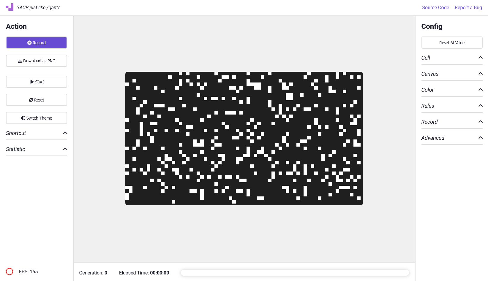

    
  <picture>
    
  </picture>
    
  <h1>Generative Art Cellular Patterns</h1>
  
A web-based application for creating generative art inspired by cellular automata, built using HTML, JavaScript, and Canvas.

   
   

## Table of Contents
- [Overview](#overview)
- [Setup](#setup)
- [Examples](#examples)
- [Known Issues](#known-issues)
- [Contributing](#contributing)
- [License](#license)

## Overview

This application showcases **generative art** inspired by cellular automata and **Conway’s Game of Life**. It leverages **HTML**, **JavaScript**, and **Canvas** to create unique and evolving patterns. Users can explore and customize various options to generate their own cellular artwork.

## Setup

To run the application, simply launch `src/app.html` in your browser. No additional installations are required.

### Configuration Options
You can modify various settings in the app to customize the generated patterns:
- Cell
- Canvas
- Color
- Rules
 - Record

## Examples

There can be great beauty in chaos

    

## Known Issues
- **Responsive Design**: The UI is not optimized for mobile devices.
- Aspect ratio doesn't disable properly

## Contributing

We welcome contributions! If you find a bug, have ideas for improvements, or want to help expand the project, feel free to open an issue or submit a pull request.

### Current Work in Progress
- UI Prototype and improvements
- Small fixes and optimizations
- Improving customizability

## License

This project is licensed under the **GNU General Public License v3.0**. For more details, please see the [LICENSE](./LICENSE) file.

### Additional Resources
- [Conway’s Game of Life](https://en.wikipedia.org/wiki/Conway%27s_Game_of_Life)
- [Cellular Automata](https://en.wikipedia.org/wiki/Cellular_automaton)
