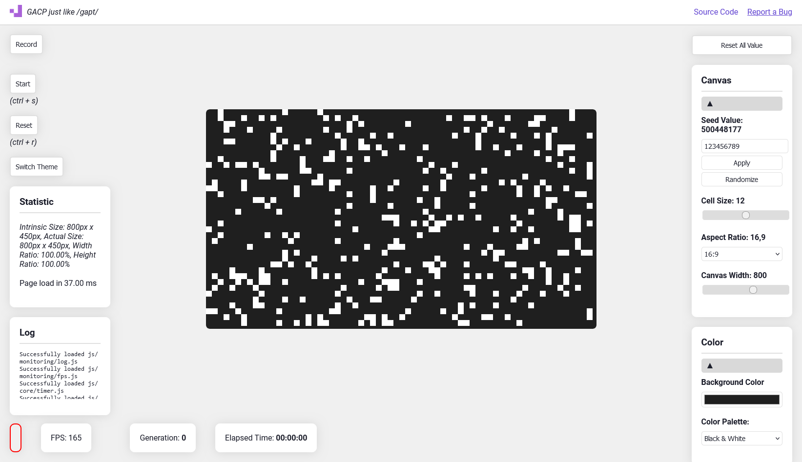

# Generative Art Cellular Patterns
This web-based/ prototype showcases generative art inspired by cellular automata and game of life (cf Conway), leveraging HTML, JavaScript, and Canvas for creating patterns. 

## Know issue
- Responsive (Mobile UI)
- 1/1 AR overflow: with a large width and aspect ratio 1:1 the canvas will make the footer dissapear by getting the div bigger, I have no idea why it do that and I can't figure out a solution yet.

## Setup

Work by launching `app.html` in a browser

## Overview

## Example

There can be great beauty in chaos

    

